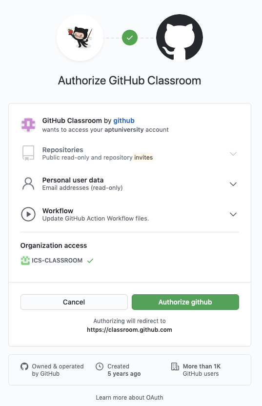
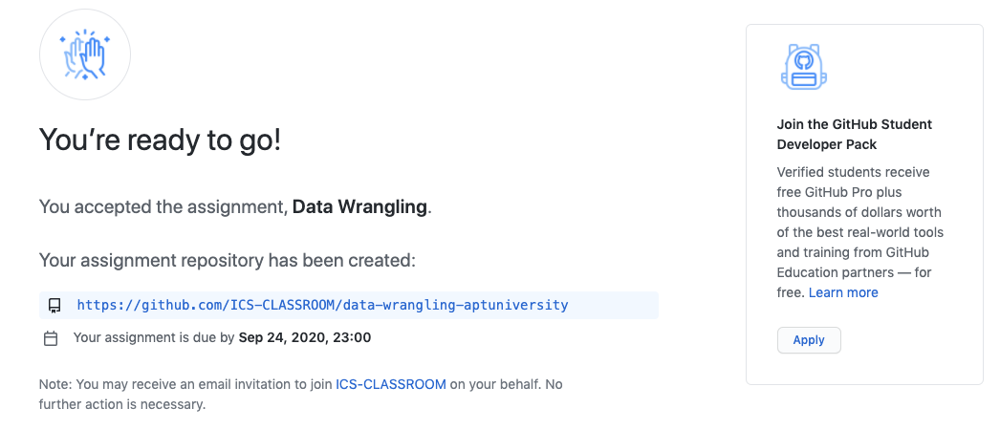
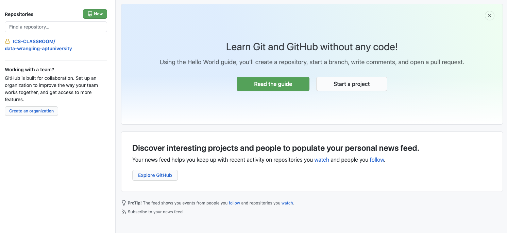

# Assignment 1: Data Wrangling

Please follow the instruction below to clone the assignment into your GitHub account. If you don’t already have a GitHub account, you will need to create one first.

1. Navigate to the GitHub assignment page located at the following URL:

https://classroom.github.com/a/zYPwxMIt

2.  You should see a message similar to the following prompting you to authorize “GitHub Classroom” to access your account.  Click “Authorize github” to continue.

3. A message prompting you to accept the assignment will be displayed (see image below). Click “Accept this assignment.”

4. By accepting the assignment, GitHub will clone the assignment repository in your account. The repository name should have the following name structure:
`data-wrangling-XYZ` ,
where `XYZ`  you GitHub username. After the process completes, you will receive a message similar to that in the screenshot below. You are now ready to clone your assignment repository.

5. Click on the  repo link to see your repo — in this example the repo link is: 

Clone the repo to work on your assignment locally and push your work on a regular basis to save your progress. 
